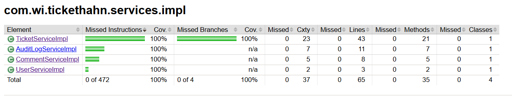

# TicketHahn

TicketHahn is a ticket management system built with Spring Boot and Java Swing. It allows users to create, update, and manage tickets, comments, and audit logs.

## Table of Contents

- [Features](#features)
- [Technologies Used](#technologies-used)
- [Getting Started](#getting-started)
- [Build the Project](#build-the-project)
- [Running the Application](#running-the-application)
- [API Endpoints](#api-endpoints)
- [Contributing](#contributing)
- [License](#license)
- [Code Coverage](#code-coverage)
## Demonstration Video

Watch the demonstration video to see TicketHahn in action:

[]

## Features

- Create, update, and delete tickets
- Add comments to tickets
- Track changes with audit logs
- User authentication and authorization
- Java Swing client for managing tickets

## Technologies Used

- Java 17
- Spring Boot
- Spring Data JPA
- Hibernate
- Oracle Database
- H2 Database (for testing)
- ModelMapper
- Lombok
- Java Swing
- Docker
- Maven

## Getting Started

### Prerequisites

- Java 17
- Maven
- Docker

### Clone the Repository

```sh
git clone https://github.com/your-username/tickethahn.git
cd tickethahn
```

## Build the Project

```sh
mvn clean install
```

## Running the Application

### Using Docker

Start the services using Docker Compose:

```sh
docker-compose up
```

The application will be available at [http://localhost:8080](http://localhost:8080).

### Running Locally

Start the Oracle database using Docker:

```sh
docker run -d -p 1521:1521 --name oracle-db oracle/database:latest
```

Run the Spring Boot application:

```sh
mvn spring-boot:run
```

The application will be available at [http://localhost:8080](http://localhost:8080).

## API Endpoints

### User Endpoints

- `POST /api/v1/auth` - Sign up a new user
- `GET /api/v1/auth/all` - Get all users

### Ticket Endpoints

- `POST /api/v1/tickets` - Create a new ticket
- `GET /api/v1/tickets` - Get all tickets
- `GET /api/v1/tickets/{id}` - Get a ticket by ID
- `PUT /api/v1/tickets/{id}` - Update a ticket
- `DELETE /api/v1/tickets/{id}` - Delete a ticket
- `POST /api/v1/tickets/change-status` - Change the status of a ticket
- `GET /api/v1/tickets/status/{status}` - Get tickets by status

### Comment Endpoints

- `POST /api/v1/comments` - Create a new comment
- `GET /api/v1/comments` - Get all comments

### Audit Log Endpoints

- `GET /api/v1/audit/{ticketId}` - Get audit logs for a ticket
- `GET /api/v1/audit` - Get all audit logs

## Code Coverage

To generate code coverage reports using JaCoCo, run the following command:

```sh
mvn clean test
```

The code coverage report will be generated in the `target/site/jacoco` directory. Open the `index.html` file in a web browser to view the report.